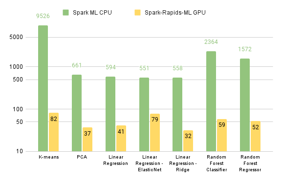

# Benchmarking
This directory contains python scripts for benchmarking the supported algorithms.  

## Local
This [script](../run_bench.sh) can be used to run them locally.  

## Databricks
They can also be run on the Databricks AWS hosted Spark service.  See [these instructions](databricks/README.md) and accompanying scripts for running a set of high compute workloads on CPU and GPU clusters.   The graph below compares the resulting Spark ML CPU and Spark Rapids ML GPU running times (averaged over 3 runs each).

