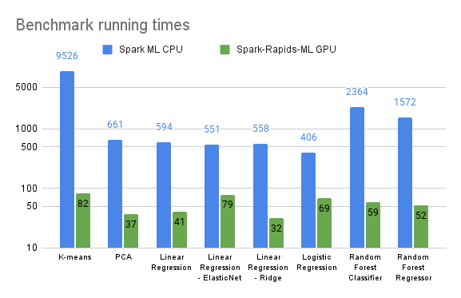

# Benchmarking
This directory contains python scripts for benchmarking the supported algorithms.

## Local
This [script](../run_benchmark.sh) can be used to run them locally.

## Databricks
They can also be run on the Databricks AWS hosted Spark service.  See [these instructions](databricks/README.md) and accompanying scripts for running a set of high compute workloads on comparable CPU and GPU clusters.   The graph below shows the resulting Spark ML CPU and Spark Rapids ML GPU average running times.

## Other CSPs
Click on the below for instructions on running the benchmarking scripts in the respective CSP Spark environments 
- [GCP Dataproc](dataproc/README.md)
- [AWS EMR](aws-emr/README.md)

